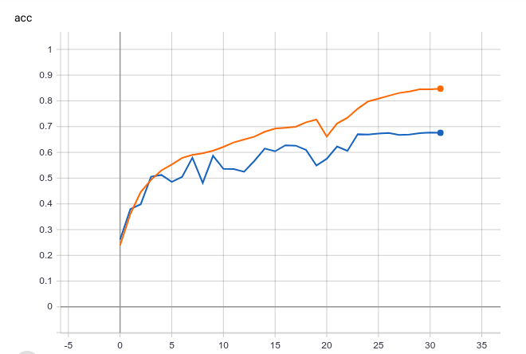
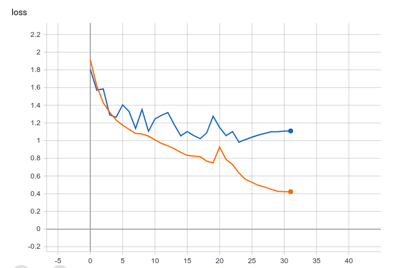

# Reaction.AI

This project was developed during HackInTheNorth4.0

The whole idea of this project is to provide an API for real-time analysis of human sentiments while they’re watching content like videos online.
We aim to solve this problem as a deep-learning problem, deep learned models from large data, robust face alignment, and expected value formulation for age regression.

## Dataset

#### Emotion Recognition
FER2013:  Data consists of 48x48 pixel grayscale images of faces. The task is to categorize each face based on the emotion shown in the facial expression in to one of seven categories (0=Angry, 1=Disgust, 2=Fear, 3=Happy, 4=Sad, 5=Surprise, 6=Neutral). The training set consists of 28,709 examples.

#### Gender and Age Prediction
IMDBDataset: We obtained 460,723 face images from 20,284 celebrities from IMDb and 62,328 from Wikipedia, thus 523,051 in total.

## Architecture
For Emotion Recognition, we trained a modified version of VGG16 architecture.

Accuracy Graph:

  

Loss Graph:

  

 - Training Accuracy: 90.50%
 - Validation Accuracy: 67.59%
 - Testing Accuracy: 66.17%

 - Inference Time: 0.4464 sec

## Dependencies

This project is built on Python3
 - Matplotlib
 - TensorFlow
 - Keras
 - Django
 - OpenCV
 - py-agender

Laptop/Desktop Camera access is required

## Applications
Following are some of the applications of Reaction.AI
 - Age Approximation
 - Detect Target Audience to produce better content
 - Avoid Fake reviews
 - Block offending videos
 - Get how the content is reviewed within seconds of release
